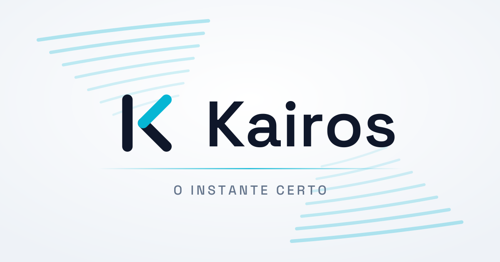

<picture>
  <source srcset="brand/kairos-cover-dark.svg" media="(prefers-color-scheme: dark)">
  
</picture>

Reimplementação do Hermes a partir das especificações geradas pelo Reversa.

A origem fica no histórico e nas referências de spec (`enforced_at`,
`source_ref`, `unit=`), que é onde rastreabilidade pertence. O que **roda** é
Kairos: identidade, rotas, header de sessão e health check. `brand/` traz o
manual da marca.

**Specs (fonte da verdade):** `../hermes-agent/_reversa_sdd/`
**Plano de reconstrução:** `../hermes-agent/_reversa_sdd/reconstruction-plan.md`

O Kairos é **reimplementação, não fork**: livre para corrigir os 5
anti-padrões catalogados em `architecture.md#8`. As divergências deliberadas
em relação ao legado estão em [`docs/decisoes.md`](docs/decisoes.md).

## Estado

| Tarefa | Status |
|---|---|
| 01 — Schema do banco de dados | ✅ concluída |
| 02 — Entidades de domínio | ✅ concluída |
| 03 — Máquinas de estado | ✅ concluída |
| 04 — native (`fts5_cjk`) | ✅ concluída |
| 05 — hermes-state | ✅ concluída |
| 06 — i18n | ✅ concluída |
| 07 — container | ✅ concluída |
| 08 — tools | ✅ concluída |
| 09 — skills | ✅ concluída |
| 10 — plugins | ✅ concluída |
| 11 — providers-gateway | ✅ concluída |
| 12 — mcp | ✅ concluída |
| 13 — agent | ✅ concluída |
| 14 — cron | ✅ concluída |
| 15 — hermes-cli | ✅ concluída |
| 16 — ui-tui | ✅ concluída |
| 17 — acp-adapter | ✅ concluída |
| 18 — web | ✅ concluída |
| 19 — apps-desktop | ✅ concluída |
| 20 — Integração | ✅ concluída |
| 21 — evals | ✅ concluída |

As 21 unidades do plano histórico foram reconstruídas, mas esse quadro não
certifica conclusão operacional de todas as funcionalidades. O inventário atual,
as validações e os bloqueios estão em [Progresso funcional](docs/functional-progress.md).

## O executável

```bash
uv pip install -e .
kairos --version
kairos doctor
kairos approvals test "rm -rf build" --deny "rm *" --yolo   # sai 3: deny vence yolo
```

São **50 comandos** declarados na superfície. Os implementados usam as units reconstruídas; os demais
saem com código **69** e dizem qual unit já existe — nunca com 0 em silêncio.

## Agendamentos

A tela Agendamentos e `kairos cron` administram jobs persistidos com execução real
e histórico. Consulte [uso e limites](docs/agendamentos.md).

## Chat, modelos e providers

A SPA principal em `/` oferece Chat, catálogo de modelos e configuração de
providers. WebSocket e CLI usam o mesmo serviço de interação e o mesmo
protocolo versionado. Consulte [`docs/providers-e-chat.md`](docs/providers-e-chat.md)
para configuração, OpenRouter, Ollama, operação e rollback.

## Auditoria de segurança

```bash
kairos security                  # runtime (~/.kairos) + código-fonte
kairos security --no-source      # só o runtime
kairos security --source .       # aponta a raiz do código explicitamente
kairos security --fail-on low    # reprova em qualquer achado
kairos security --json           # para script/CI
```

A auditoria cobre **dois alvos diferentes**, e é importante não confundi-los:
o *runtime* (`~/.kairos`: permissões de `auth.json`, credenciais gravadas,
guardrails carregados) e o *código-fonte* (o repositório). Auditar um não diz
nada sobre o outro — a versão anterior só olhava o runtime e por isso dava
100/100 enquanto o servidor web tinha um token fixo no código.

O SAST (`SEC-SRC-*`) não é um linter genérico: cada regra corresponde a um
defeito já encontrado neste projeto ou caro o bastante para valer o
falso-positivo. Ele **não audita código de teste** — fixture é insegura de
propósito — e cada regra propensa a ruído tem um validador (`DIRECT_API_KEY =
"direct_api_key"` é constante de enum, não credencial; `md5(usedforsecurity=
False)` já se declarou fora de uso criptográfico).

Sai com **1** quando há achado no nível de `--fail-on` (padrão: `high`), o que
o torna utilizável como passo de CI.

## Ambiente

O projeto usa [uv](https://docs.astral.sh/uv/) e fixa **Python 3.11**, a mesma
versão do legado (`.python-version`). O Python do sistema é 3.14, então o
`uv` provisiona o 3.11 próprio — não dependa do interpretador global.

```bash
uv venv --python 3.11     # cria .venv com o 3.11 gerenciado pelo uv
uv pip install -e ".[dev]"
```

## Imagem de container

```bash
docker build -t kairos:test .
```

Os testes de integração (`RealImageTests`) verificam contra a imagem
construída e são **pulados** se ela não existir. Eles cobrem o que o
`docker build --check` não alcança: deriva entre `pyproject.toml` e o
Dockerfile, diretórios de destino e o `PATH` de runtime.

Sem comando, o container é o serviço: o s6 supervisiona `main-kairos` (o
gateway) e `dashboard`. Com comando (`docker run kairos chat`), o comando roda
como *main program* ao lado dos serviços.

## Deploy (Komodo)

A stack vive no Komodo em modo **Git**: o periphery clona este repositório e
usa o `compose.yaml` da raiz. Como o clone traz o código, o `build:` do compose
funciona — não há imagem a publicar em registry.

Dois campos da stack não são o padrão e precisam continuar assim:

| campo | valor | porquê |
|---|---|---|
| `auto_pull` | `false` | a imagem é buildada, não puxada; o `compose pull` falha com *pull access denied* |
| `run_build` | `true` | é o que dispara `docker compose build` |

A stack monta o `web-token` e a passphrase administrada a partir de arquivos;
o token não é injetado no HTML. A porta permanece publicada **só** no endereço
Tailscale do host, e a SPA autentica por cookie `httpOnly`.

## CI

`.github/workflows/ci.yml` roda oito jobs em paralelo: testes, ruff, shellcheck,
hadolint, imagem+integração, frontends, gate de recall e `uv lock --check`.
Actions fixadas por **SHA**, não por tag — tag é mutável. Fixar por SHA cobra
o seu preço: um SHA que não existe derruba o job já no *Set up job*, com uma
mensagem que não menciona o pin.

`scripts/ci.sh` roda **exatamente os mesmos passos** localmente, o que troca um
ciclo de minutos por um de segundos:

```bash
scripts/ci.sh          # tudo
scripts/ci.sh --fast   # pula o que exige Docker
```

Cada passo é pulado com aviso, não silenciosamente, quando a ferramenta falta.

## Frontends (TypeScript)

As units `ui-tui`, `web` e `apps/desktop` são TypeScript/React e têm suítes próprias:

```bash
for f in ui-tui web apps/desktop; do
  npm install --prefix "$f"
  npm test --prefix "$f"                 # vitest
  npx --prefix "$f" tsc --noEmit -p "$f"
done
```

`scripts/ci.sh` roda os seis passos junto com o resto.

## Rodar os testes

A extensão CJK opcional exige `gcc`:

```bash
./native/fts5_cjk/build.sh    # instala em $KAIROS_HOME/lib
```

Sem ela a suíte passa igual — os testes que a exigem são pulados, que é o
comportamento correto: a extensão é opcional por desenho.

```bash
uv run pytest -q                          # caminho normal
.venv/bin/python -m unittest discover -s tests   # sem dependência nenhuma
```

A suíte é escrita em `unittest` da biblioteca padrão, então roda dos dois
jeitos. `pytest` só é necessário para o relatório mais legível — nunca para
que os testes existam.

## O token de acesso do painel

O painel exige um token. Três formas de obtê-lo, em ordem de precedência:

```bash
kairos token new      # gera e grava em KAIROS_HOME/web-token, com permissão 0600
kairos token show     # mostra só um prefixo — o valor inteiro exige --reveal
kairos token path     # onde o arquivo está
```

O arquivo existe para haver um caminho estável que **não passe por variável de
ambiente**: `printenv`, `docker inspect` e um dump de configuração revelam a
variável a quem alcança o host; um arquivo 0600 não aparece em nenhum deles.

`KAIROS_WEB_TOKEN` continua tendo precedência, para quem precisa injetar o
valor de um cofre. Sem nenhum dos dois, o servidor gera um por processo — mais
seguro, mas invalida as abas abertas a cada restart.

Para usar sem deixar o valor no histórico do shell:

```bash
export KAIROS_WEB_TOKEN="$(cat "$KAIROS_HOME/web-token")"
```

Um teste verifica que nenhuma linha de log do servidor menciona o token.

## Sessões no painel

O menu **Sessões** consulta o histórico salvo em `state.db`. Ele permite buscar
por título, origem, modelo ou conteúdo, filtrar por estado e tags, navegar por
páginas, abrir a transcrição, editar tags, arquivar ou ocultar uma sessão sem
apagar o transcript.

No detalhe, a conversa pode ser exportada como JSON ou Markdown. Sessões
ocultas continuam recuperáveis pelo filtro **Ocultas**; nenhuma ação da
interface remove fisicamente dados.

## Entrega de alterações do runtime

O runtime trabalha sobre uma versão fixa do projeto. Revise o diff do checkpoint
antes de aplicar o pacote em uma branch isolada; os testes precisam passar antes
da abertura do PR. Consulte o [guia de entrega do runtime](docs/runtime-delivery.md)
para exportar versões, revisar, aplicar e publicar alterações.
